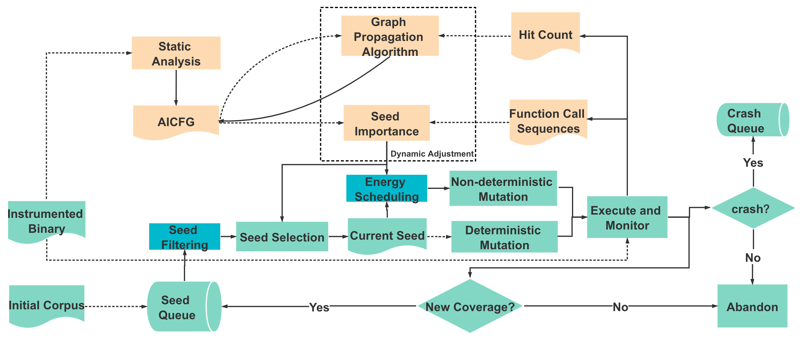

# The Optimizing Graybox Fuzzing with Well Informed Seed Prioritization

We have presented a holistic approach to optimize seed prioritization and energy scheduling in CGF tools, based on the importance of seeds. The importance of a seed captures both the execution trace triggered by the seed and a number of code features of the code blocks along the trace, and can be dynamically adjusted throughout the fuzzing campaign.

All clean code and data will add soon.....
